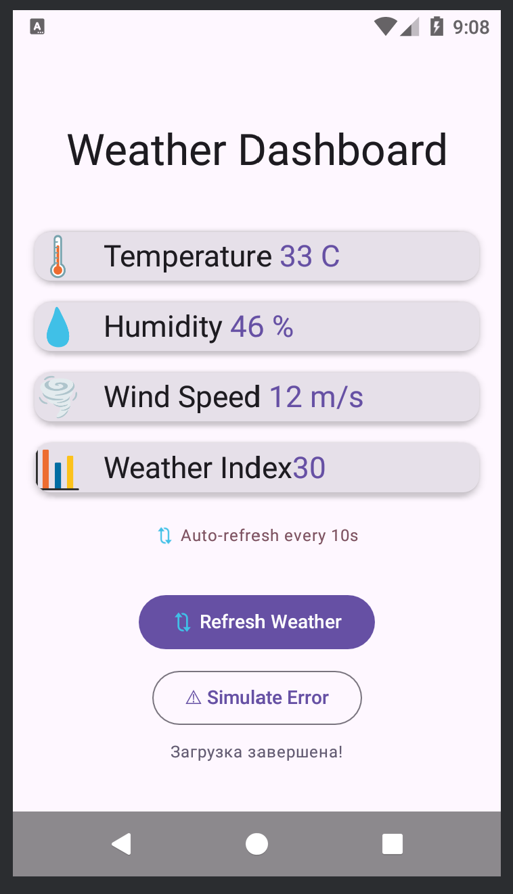
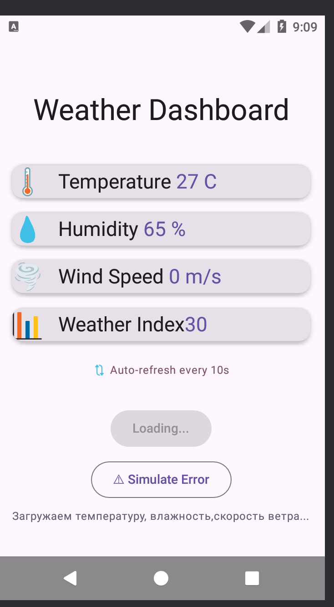

# Weather Dashboard

Приложение которое показывает влажность, температуру, силу ветра, автообновление каждые 10 секунд

## Функционал

- Показ температуры
- Показ влажности
- Показ силы ветра
- возможность принудительного обновления
- автообновление
- остановка

## Технологии

- Kotlin
- coroutines dependencies
- Jetpack Compose
- Material Design 3
- ViewModel
- StateFlow

## Контрольные вопросы

1) Это разные способы запуска корутин, launch запускает корутину и не возвращает резултат, async же возвращает
   1) launch когда не нужен результат, async - когда нужен
      2) ```kotlin
         viewModelScope.launch {
         repository.saveData()
         }

         viewModelScope.launch {
            val humidityDeferred = async { repository.fetchHumidity() }
                val humidity = humidityDeferred.await()
                println(temperature)}
         ```

2) Это функция которая может быть приостановлена и продолжена без блокировки потока
   1) Нет не может
   2) delay приостанавливает корутину а не поток
3) Для определения какие корутины в каком потоке будут работать
   1) | Диспетчер       | Для чего используется         | Примеры задач                          |
      |-----------------|------------------------------|----------------------------------------|
      | Dispatchers.Main | Работа с UI                 | Обновление текста, отображение данных  |
      | Dispatchers.IO  | Ввод-вывод (сеть, файлы, БД)| Запрос к серверу, чтение файла         |
      | Dispatchers.Default | Тяжёлые вычисления         | сложные расчёты                        |

   2) Интерфейс зависнет и экран тоже, потому что мейн не для больших вычислений
4) Корутина закончится с ошибкой и может крашем
   1) использовать try except
   2) Чтобы обработать ошибку в корутине и не дать ей упасть
5) корутины привязаны к жизненому циклу и если ViewModel уничтожается то корутина тоже
    1) это функция которая привязана к жизненному циклу ViewModel
    2) Когда уничтожается ViewModel


## Запуск проекта

- Перед началом работы склонируйте этот репозиторий к себе на компьютер 
```
    git clone https://github.com/Arturnio/Android_laba17-18_kuzvah.git
```

 - После чего перейдите в папку проекта

```
    cd repository
```

- Запустите Android Studio

- Нажмите Run


## Скриншоты





## Авторы

Кузнецов АО Вахрушева АП ИСП-233

14.02.2026